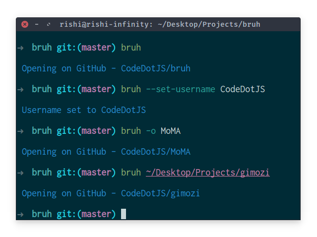

<p align="center"></p>

- __Description__

Bash script to open the GitHub repository of a cloned repo in your browser. It works from any directory within the repository or by specifying the repository folder as an argument.

<br>

- __Install__

```sh
curl -O https://raw.githubusercontent.com/CodeDotJS/bruh/master/bruh.sh && chmod +x bruh.sh
```

*and... global*

```sh
sudo mv bruh.sh /usr/local/bin/bruh
```

<br>

- __Usage__

To run the script from the current directory:

```sh
$ bruh
```

To specify a repository folder:

```sh
$ bruh /path/to/repo_folder
```

- __Screenshot__

<p align="center"></p>

<br>

- __License__

MIT
