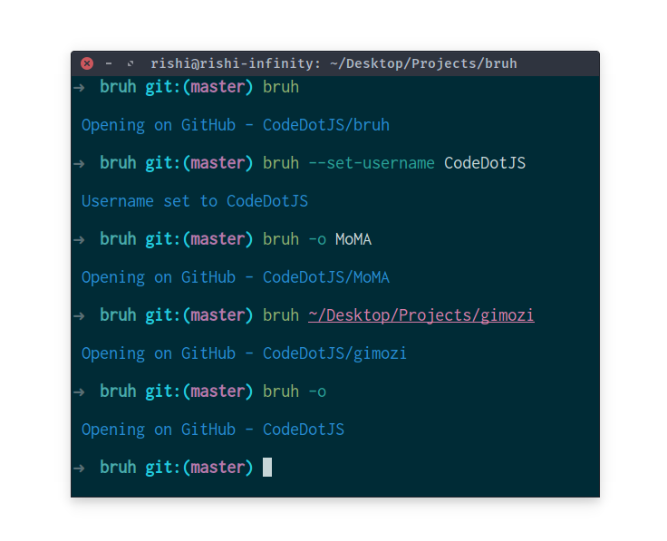

<p align="center"></p>

- __Description__

 Bash script to open a GitHub repository in your browser from any directory within the repository or by specifying the repository folder as an argument. It also supports setting your username for quickly accessing your repositories.

<br>

- __Install__

```sh
curl -O https://raw.githubusercontent.com/CodeDotJS/bruh/master/bruh.sh && chmod +x bruh.sh
```

*and... global*

```sh
sudo mv bruh.sh /usr/local/bin/bruh
```

<br>

- __Usage__

To run the script from the current directory:

```sh
$ bruh
```

To specify a repository folder:

```sh
$ bruh /path/to/repo_folder
```

Set username

```sh
$ bruh --set-username torvalds
```

```sh
$ bruh -o linux
```

- __Screenshot__

<p align="center"></p>

<br>

- __License__

MIT
